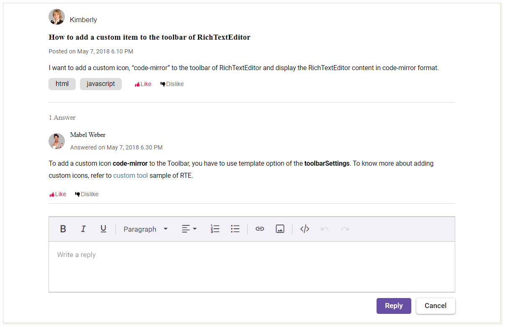

# Integrating Syncfusion Vue components to the Astro application

This article provides a step-by-step guide for setting up an Astro JS application and integrating the Syncfusion Vue Rich Text Editor components.

An `Astro JS` application, which is a modern web framework, is designed for creating high-performing websites and web applications with ease. By seamlessly combining Server-side Rendering (SSR) and Client-side Hydration, Astro empowers developers to build robust, interactive digital experiences.

## Prerequisites

Before getting started with Astro JS, ensure the following requirements are installed for creating an Astro application:

* [Prerequisites for the Astro application](https://docs.astro.build/en/install/auto/#prerequisites)
* [Prerequisites for Syncfusion Vue components](https://ej2.syncfusion.com/vue/documentation/system-requirements)

## Setting up the Astro application

Begin by creating a new [Astro app from scratch](https://docs.astro.build/en/install/auto/#installation). Initiate the process by executing the following command:

```sh
npm create astro@latest
```

Upon executing the above command, it prompted several queries. That will allow you to configure it based on your requirements.

## Incorporating Vue integrations into the Astro application

To integrate Vue components into an Astro application, which stands out among JavaScript frameworks for its compatibility with various UI frameworks like React, Vue, Preact, Svelte, Lit, or Solid, we need to incorporate Vue integrations provided by Astro.

Execute the following command to add Vue integration:

```sh
npx astro add vue
```

## Integrating the Syncfusion Vue component

Now, get started with the steps required to integrate the Syncfusion Vue component into the Astro and demonstrate a forum application using the Rich Text Editor.

1\. Syncfusion Vue components are available at npmjs.com. For now, install the Syncfusion Vue packages using the following command:

```sh
npm install --save @syncfusion/ej2-vue-richtexteditor @syncfusion/ej2-vue-buttons
```

2\. Create a dedicated Vue file, 'src/components/Forum.vue', and add the Vue Rich Text Editor component along with the UI structure.

```html
<template>
    <div>
        ...
        <div class='posting'>
            To add a custom icon
            <b>code-mirror</b> to the Toolbar, you have to use template option of the
            <b>toolbarSettings</b>. To know more about adding custom icons, refer to
            <a href='https://ej2.syncfusion.com/home/' target='_blank'>custom tool</a> sample of RTE.
        </div>
        ...
        <ejs-richtexteditor ref='rteInstance' v-model='value' v-bind:value='value'
            placeholder='Write a reply'></ejs-richtexteditor>
        <div id='buttonSection'>
        ...
    </div>
</template>
<style>
@import '@syncfusion/ej2-base/styles/material3.css';
@import '@syncfusion/ej2-inputs/styles/material3.css';
@import '@syncfusion/ej2-lists/styles/material3.css';
@import '@syncfusion/ej2-popups/styles/material3.css';
@import '@syncfusion/ej2-buttons/styles/material3.css';
@import '@syncfusion/ej2-navigations/styles/material3.css';
@import '@syncfusion/ej2-splitbuttons/styles/material3.css';
@import '@syncfusion/ej2-vue-richtexteditor/styles/material3.css';
...
</style>
<script>
import { isNullOrUndefined as isNOU } from '@syncfusion/ej2-base';
import { RichTextEditorComponent, Link, Image, QuickToolbar, HtmlEditor, Toolbar } from '@syncfusion/ej2-vue-richtexteditor';
import { ButtonComponent } from '@syncfusion/ej2-vue-buttons';

export default {
    components: {
        'ejs-richtexteditor': RichTextEditorComponent,
        'ejs-button': ButtonComponent
    },
    data: function () {
        return {
            isPrimary: true,
            value: ''
        };
    },
    methods: {
        ..…
    },
    provide: {
        richtexteditor: [Link, Image, QuickToolbar, HtmlEditor, Toolbar]
    }
}
</script>
```

3\. Import the Forum.vue component into src/pages/index.astro and incorporate it within the layout structure. Here, the Vue component can be integrated with Astro pages.

    ```html
    ---
    import Layout from "../layouts/Layout.astro";
    import Forum from "../components/Forum.vue";
    ---

    <Layout title="Syncfusion components">
        <div>
            Syncfusion Forum
            <Forum client:only />
        </div>
    </Layout>
    ```

4\. Run the Astro app using the following command:

```sh
npm run dev
```

Navigate to `http://localhost:4321/` in your preferred browser to see the rendered Syncfusion Vue components within the Astro project.

The output should look like the following image:



## Supported platforms

Syncfusion React and TypeScript components have also been seamlessly integrated with `Astro.js`, functioning smoothly like Vue components.

* [Syncfusion React components](https://www.syncfusion.com/react-components)
* [Syncfusion TypeScript components](https://www.syncfusion.com/javascript-ui-controls)
